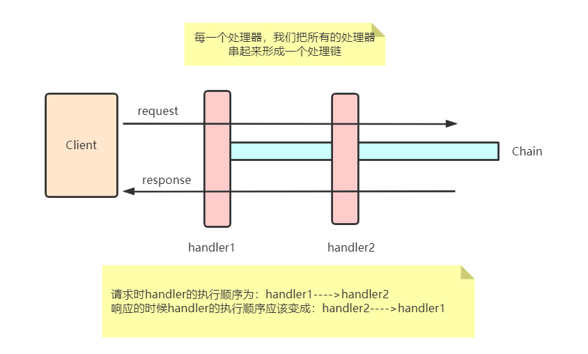

# 责任链模式
- 听说该模式是设计模式中排行第二难的模式
- 确实责任链模式在很多框架中都得到了很好的实践，比如Servlet中的Filter,在这儿我们将模仿一个简单的Servlet的Filter来让我们理解责任链模式
1. 我们假设一个场景

    我们在做一个bbs论坛，用户在评论或者发帖时我们都需要在后台进行一些处理，避免用户提交恶意脚本或者敏感词。

    用户请求进来的时候，首先我们要对用户提交的内容去恶意脚本处理，然后处理敏感词等，这些处理完后我们需要把这些东西保存到数据库，然后响应用户，但是在响应的时候
    我们可能还想对响应做一些处理

    所以我们的整个处理流程就如图所示：
    

    ### 总结
    1. 可动态添加责任对象、删除责任对象、改变责任对象顺序，非常灵活。
    2. 每个责任对象专注于做自己的事情，职责明确。